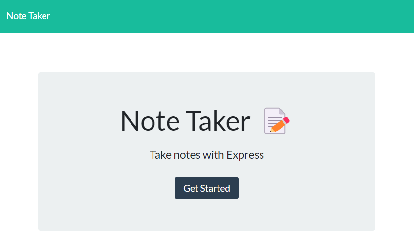

# Note Taker 📝

## Description 📃

This repo/code gives a user the ability to Take, Save, and Delete Notes. Running node, express, and utils. Feel free to navigate through the code and test run the Webpage itself. Each note created and saved is information stored in the database within the code. The database then sends this information to display onto the HTML file that handles the notes.

## Preview

* To view how to run the code below is a YouTube Video walktrough.
[Note Taker APP](https://www.youtube.com/watch?v=Qfh0r-xA6_4)

* Below is an image preview 

## Links 🖊️

* Here is the link to my github 🐈‍⬛: [Github/JMGuzman-784](https://github.com/JMGuzman-784/hw11)

* Here is the link to the webpage 🖥️: [JMGuzman-784/Note-Taker](https://app-4-taking-notes.herokuapp.com/)

* Here is the code 📜: [JMGuzman-784/Note-Taker](https://github.com/JMGuzman-784/hw11/blob/main/server.js)
